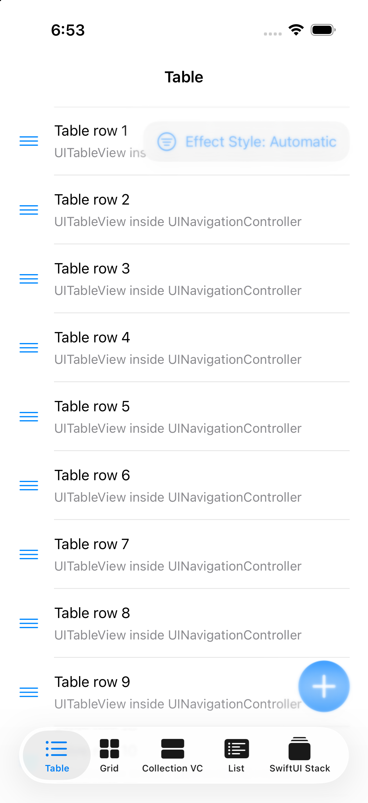
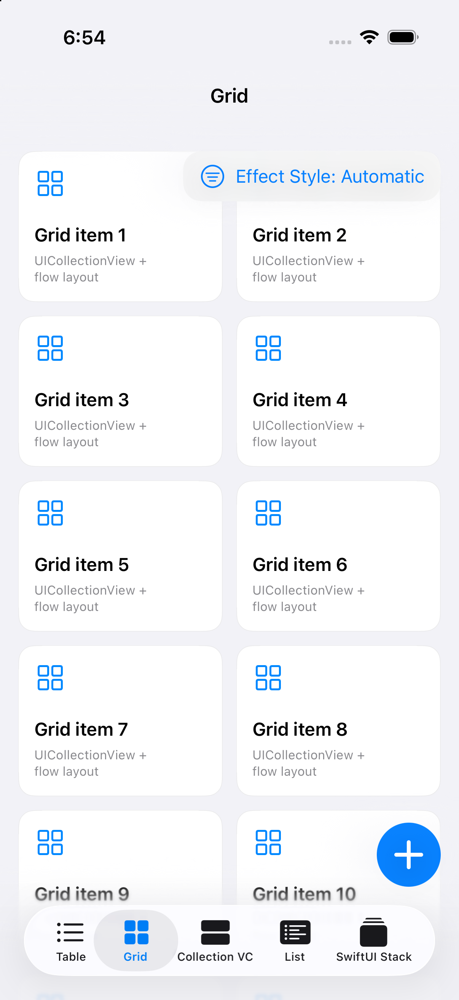
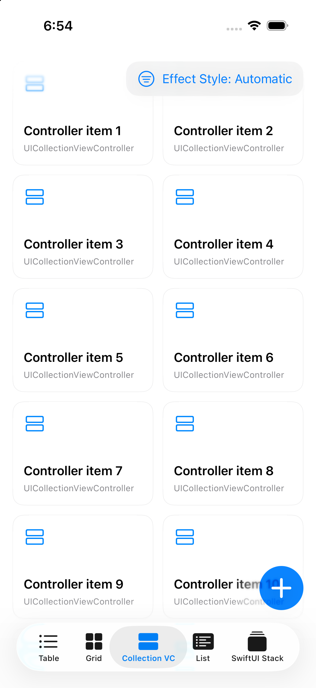
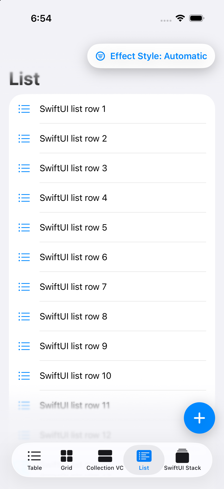
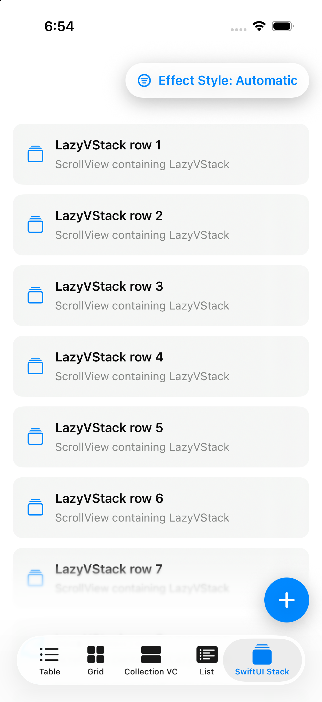
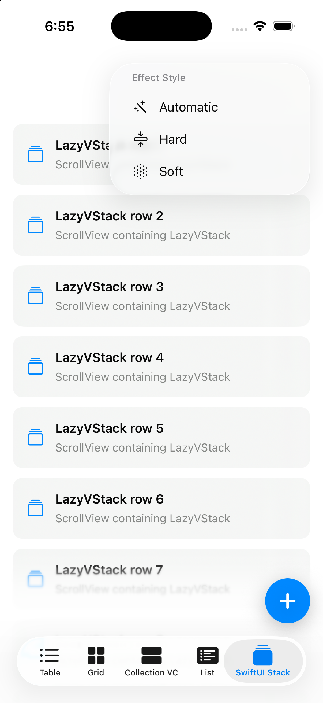

# ScrollEdgeEffectBlurIssue

Minimal iOS repro project for scroll edge effect and blur behavior across UIKit and SwiftUI.

This repo exists so other developers can inspect, reproduce, and help debug scroll edge effect behavior around edge-attached controls, blur, and `safeAreaBar`.

The sample compares these cases:

- `UITableView` in a `UINavigationController`
- `UICollectionView` in a custom `UIViewController`
- `UICollectionViewController`
- SwiftUI `List`
- SwiftUI `ScrollView` with `LazyVStack`

Each screen exposes the scroll edge effect style controls for `automatic`, `hard`, and `soft`, plus top and bottom edge-attached controls. The SwiftUI list sample includes an inline note around the `safeAreaBar(edge: .top)` placement that appears related to janky scrolling.

## Screenshots

<table>
  <tr>
    <td align="center"><strong>UIKit Table</strong></td>
    <td align="center"><strong>UIKit Grid</strong></td>
    <td align="center"><strong>UICollectionViewController</strong></td>
  </tr>
  <tr>
    <td></td>
    <td></td>
    <td></td>
  </tr>
  <tr>
    <td align="center"><strong>SwiftUI List</strong></td>
    <td align="center"><strong>SwiftUI ScrollView</strong></td>
    <td align="center"><strong>Effect Style Menu</strong></td>
  </tr>
  <tr>
    <td></td>
    <td></td>
    <td></td>
  </tr>
</table>

## Repro Notes

- The top control changes between `.automatic`, `.hard`, and `.soft`.
- The floating bottom button is attached to the bottom scroll edge.
- In `SwiftUIListSampleView`, moving the top `safeAreaBar(edge: .top)` inside the `NavigationStack` reproduces the janky scroll behavior this project is meant to isolate.
- UIKit samples use `UIScrollEdgeElementContainerInteraction`; SwiftUI samples use `safeAreaBar` and `scrollEdgeEffectStyle`.

## Project Layout

```text
ScrollEdgeEffectBlurIssue/
  App/                    App lifecycle and root tab/sidebar controller
  Shared/
    Models/               Cross-framework edge effect style model
    Data/                 Small sample data helpers
  Samples/
    UIKit/
      ViewControllers/    UITableView, UICollectionView, and UICollectionViewController samples
      Views/              Reusable UIKit cells/views
      Support/            UIKit scroll edge effect wiring
    SwiftUI/
      Views/              List and ScrollView repro screens
      Controls/           Top menu and bottom button used by SwiftUI samples
  Assets.xcassets/
```

## Requirements

- Xcode 26.5 or newer
- iOS 26.0 or newer simulator/runtime

## Run

Open `ScrollEdgeEffectBlurIssue.xcodeproj`, select the `ScrollEdgeEffectBlurIssue` scheme, and run on an iPhone or iPad simulator.

From the command line:

```sh
xcodebuild \
  -project ScrollEdgeEffectBlurIssue.xcodeproj \
  -scheme ScrollEdgeEffectBlurIssue \
  -destination 'platform=iOS Simulator,name=iPhone 17 Pro,OS=26.5' \
  build
```

## What To Look At

- App entry point and tabs: `ScrollEdgeEffectBlurIssue/App/RootTabBarController.swift`
- Shared edge effect model: `ScrollEdgeEffectBlurIssue/Shared/Models/EdgeEffectChoice.swift`
- UIKit scroll edge effect setup: `ScrollEdgeEffectBlurIssue/Samples/UIKit/Support/UIKitEdgeEffectController.swift`
- SwiftUI `List` behavior: `ScrollEdgeEffectBlurIssue/Samples/SwiftUI/Views/SwiftUIListSampleView.swift`
- SwiftUI `ScrollView` behavior: `ScrollEdgeEffectBlurIssue/Samples/SwiftUI/Views/SwiftUIScrollSampleView.swift`
